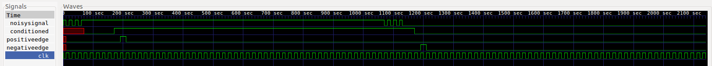

# Nice Try Lab 2 Report

Carl Moser, Louise Nielsen, Camille Xue

## Input Conditioner

REMAINING DELIVERABLES
- circuit diagram

The input conditioner is tested with 2 main cases: short bounces between 0 and 1 at the begining and then settling to either 0 or 1. The noisy pin is flipped quickly between 0 and 1 6 times at the beginning of the test, and then the settles to 1. This shows how the input conditioner handles a noisy signal, how the conditioned output changes after the noise settles, and the positive edge being detected. The input remains high for some time before there is more noise and the signal settles to 0. This change between the 1 and the 0 allows the negative edge to trigger and also tests the debouncing when the conditioned output is already high.

_If the main system clock is running at 50MHz, what is the maximum length input glitch that will be suppressed by this design for a waittime of 10?_

We can convert the frequency into the time period for one cycle using the formula T = 1/f where f is 50 MHz. This gives us a period of 20 ns. The wait time is incremented on every positive clock edge so the time until the output would change would be 10 * 20 ns = 200 ns. The maximum length glitch that would be suppressed by this design would be just under 200 ns.

## Shift Register

We wanted to check that parallel load worked, that serial load worked, and that parallel data in had priority over serial load, and that this all worked for serial data out.

Priority (parallel vs serial load): We tested this by asserting `parallelLoad` with the least significant bit of `parallelDataIn` different from `serialDataIn` (in the first test).

Parallel load works: We tested this by loading a number (b10010100) into the shift register and comparing it against that number.

Serial load works: We ran two tests that checked this. First, starting from parallel out of b10010100 (from above), we serially loaded 8 1s, until the whole shift register held 1s. We tested this by comparing against the value above inverted, shifted left by the index of the for loop, and inverted again (effectively shifting left by right padding with 1s instead of 0s). Second, we parallel loaded in all 0s and then serial loaded in b10010100 (that same value). We tested this by comparing against the value right shifted by width minus index.

Because we had thoroughly tested this for `parallelDataOut`, in order to test `serialDataOut`, we just compared it (in all of the above cases) to the most significant bit of `parallelDataOut`.

## Midpoint Check In

### Test Sequence
These are the steps a test engineer should follow to verify that our midpoint module works as intended on an FPGA.
1. Testing Parallel Load & Parallel Out
 - Press Button 0 to signal Parallel Load
 - Since our parallel load value is pre-determined, you should just see the results. The LSB's should display on the LED and the expected results are 0100.
 - To see the MSB's, toggle Switch 2 on. The expected results are 1001.

2. Testing Serial Load & Parallel Out
 - To input serial data, use Switch 0. Having on gives a 1 and having it off gives a 0 as the serial data input
 - Switch 1 on to send peripheral clock edge, which inputs the serial data
 - repeat this until 8 bits have been inputted
 - See result and expect the same values as what was inputted. Use switch 2 to toggle between seeing the 4 LSBs and the 4 MSBs

## Finite State Machine

Our Finite State Machine determines the control signals `miso_buff` (MISO buffer), `dm_we` (write enable for data memory), `addr_we` (write enable for address latch), and `sr_we` (write enable/parallel load for shift register) based on what state it is in. The flow between states is shown in the above diagram. The FSM ensures that the SPI is doing the right things at the right time, and it does that by keeping track of how many serial clock cycles have gone by using a counter. Because we are using a counter, this is not a pure state machine. When Chip Select goes low for the first time, it goes into the first state `ADDR`. At this point, the MOSI pin is sending 7 bits for the address. It stays in this state until the counter is 8 and the full address has gone by. The next bit is the `R/~W` bit or the `ShiftRegOutP[0]` value, which determines whether the SPI should be reading or writing. When this bit is 1, it will read, otherwise it will write.

Up until this point, both paths have been identical, but once it starts reading or writing, the paths diverge. In the read case, it is in the state `READ_LOAD` for one clock cycle, and then it reads the bits until the 16th clock cycle. For the write case, it doesn't write to the data memory until the very end so write only goes to `WRITE_DM` on the 15th clock cycle. Finally, if `CS` is still high, the next state will be `ADDR` again, otherwise it will go to the final state and stay there until it changes again. The counter and all outputs are set to 0.

This is not reflected in our FSM diagram (to prevent it from being too busy), but if `CS` goes high during any state in the diagram, the state transitions to `FINAL` and the counter is set to 0.

The outputs for each control signal for a given state are shown in the table below.

| Current state | `miso_buff` | `dm_we` | `addr_we` | `sr_we` |
|---|---|---|---|---|
| `ADDR` | 0 | 0 | 0 | 0 |
| `RW` | 0 | 0 | 1 | 0 |
| `READ_LOAD` | 1 | 0 | 0 | 1 |
| `WRITE` | 0 | 0 | 0 | 0 |
| `READ` | 1 | 0 | 0 | 0 |
| `WRITE_DM` | 0 | 1 | 0 | 0 |
| `FINAL` | 0 | 0 | 0 | 0 |

## SPI Memory Testing

REMAINING DELIVERABLES:
- working SPI memory
- some way to test it
- detailed analysis of our testing strategy

## Work Plan Reflection

### Week 1

Overall we didn't spend too much more time than we planned. One of our tasks, making the shift register took exactly as much time as we predicted. The input conditioner took about an hour longer than we predicted and we ended up finishing it by the end of our Wednesday meeting. The shift register and test was done by the time of our meeting as planned. We also did work on the midpoint like we planned, but that also took about 1.5 more hours than we allocated since we worked past our meeting end time and went to NINJA hours the next day to debug the FPGA testing aspect. Generally, we weren't as far off with our planning compared to our work plan for the last lab. 

### Week 2

We didn't meet our deadlines for the tasks related to making the SPI memory. The FSM was diagramed out on Monday and then created on Tuesday instead of both of those being done by Sunday. It also took about 1 hour longer than anticipated because it was broken up into those two steps. Testing the FSM also proved to be a task itself that we didn't explicitly allocate time for, which took about an hour.  The SPI memory module wasn't done until Thursday night since we had spent most of Wednesday finishing up the FSM. When the SPI module was worked on and completed, it took only about 30 minutes more than we thought it would, which was good. For the report, we spent approximately the same amount of time as was allocated and we did do it on Thursday, which was what we set on our workplan.

Considering all of the tasks of Week 2, we didn't do a great job of following our own deadlines. This wasn't really a problem in the planning but more in the excecution, probably because we weren't all constantly referring to our original workplan to see if we were on track or not. In the future we will make sure to check our workplan more often to make sure we don't fall behind. We'll also try to refine our time prediction for tasks even further, primarily by setting aside more time for testing and debugging.
